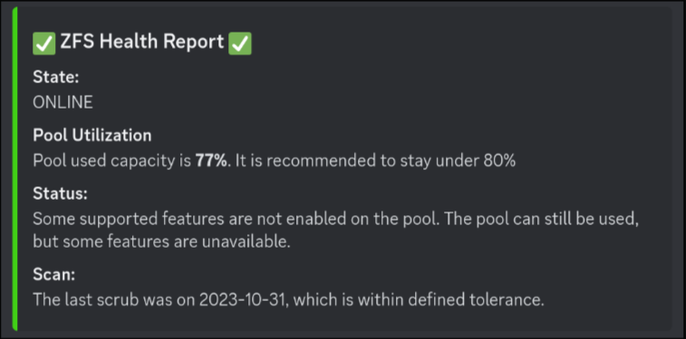
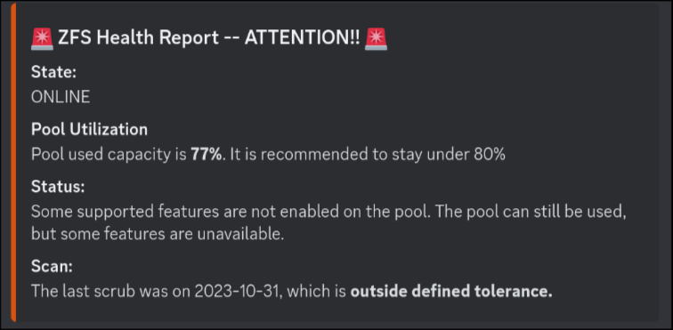

# zfs-status-to-discord

A little project built to deliver nicely formatted reports on the state of your
`zfs` storage pool to a Discord server.

  
   
  
 
<ins><b><i>Healthy and unhealthy examples, respectively</i></b></ins>

## Getting started

- Clone this repo
- Create a `.env` file based on `.env.example` and update with your webhook
URL(s)
- Build the executable `CGO_ENABLED=0 go build -o zfs_report`

> **Note**
> I wanted the message to be routed to a different channel when there was an
> unhealthy state detected, so I have two webhooks in my file, but you can use
> the same webhook for both variables if you want the messages to always go to
> one channel.

If you're not sure how to make and use Discord webhooks, you can check out
[this intro to Discord webhooks documentation](https://support.discord.com/hc/en-us/articles/228383668-Intro-to-Webhooks#making-a-webhook).
